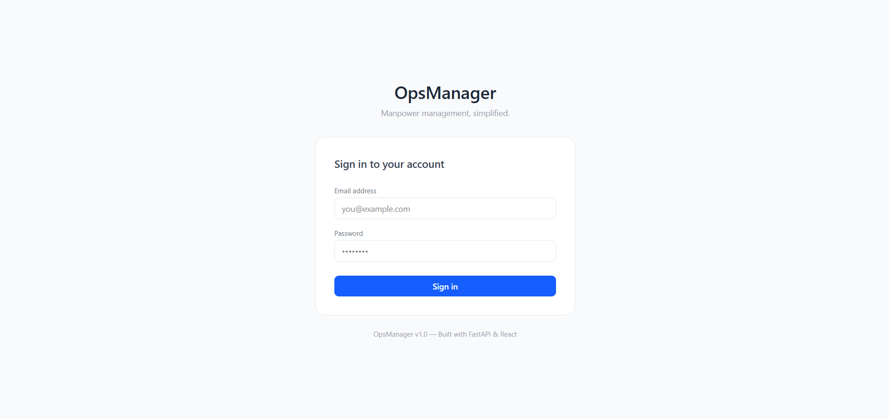
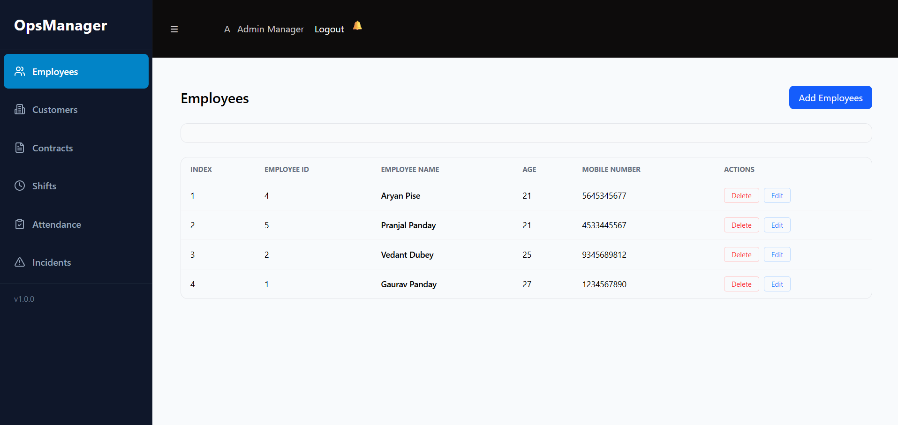
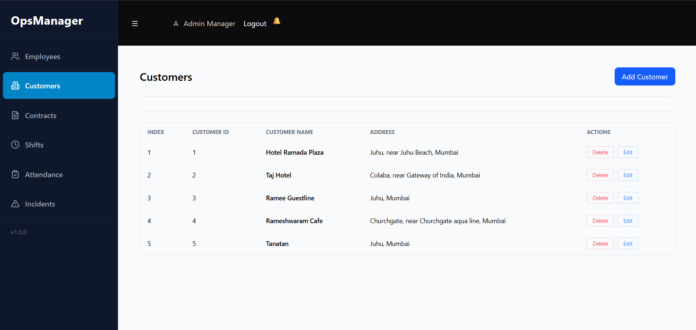
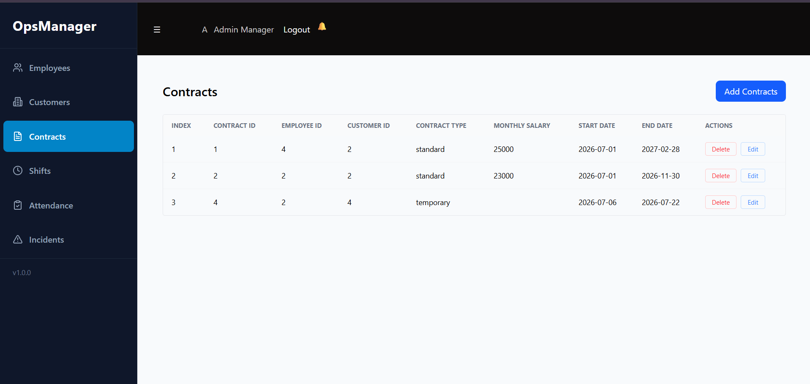
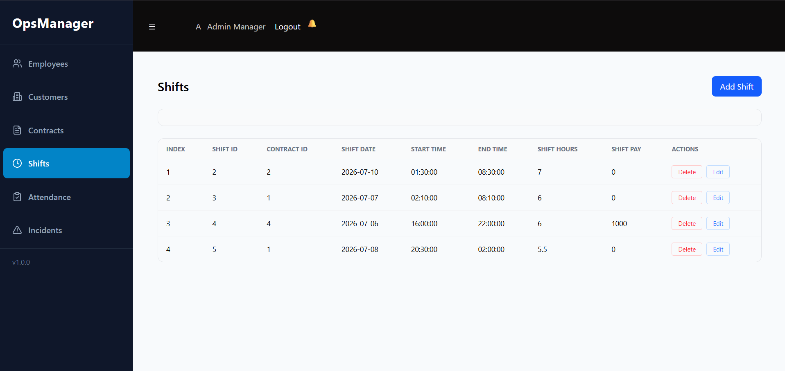
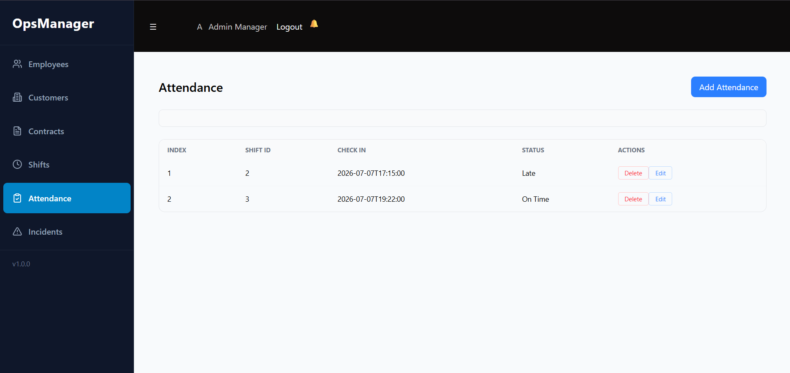
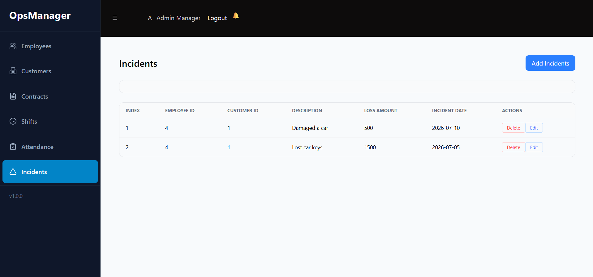

# Manpower Management System — Frontend

A modern React-based frontend for a Manpower Management System that allows users to manage employees, customers, contracts, shifts, attendance, and workplace incidents through a clean and responsive interface.

---

## Live Demo

Frontend:
https://manpower-management-app-frontend.vercel.app/

Backend API:
https://manpower-management-app-backend.onrender.com

Backend Repository:
https://github.com/VD400/manpower-management-app-backend

---

## Features

- JWT Authentication
- Login & Registration
- Protected Routes
- Employee Management
- Customer Management
- Contract Management
- Shift Management
- Attendance Tracking
- Incident Tracking
- Responsive UI
- CRUD Operations
- API Integration

---

## Tech Stack

- React
- Vite
- JavaScript
- Tailwind CSS
- React Router
- Fetch API

---

## Screenshots

### Login



---

### Employees



---

### Customers



---

### Contracts



---

### Shifts



---

### Attendance



---

### Incidents



---

## Project Structure

```
src/
│
├── components/
├── pages/
├── assets/
├── App.jsx
├── App.css
├── index.css
└── main.jsx
```

---

## Running Locally

```bash
git clone https://github.com/VD400/manpower-management-app-frontend

npm install

npm run dev
```

---

## Environment Variables

```
VITE_API_URL=
```

---

## Future Improvements

- Dashboard Charts
- Search & Filters
- Pagination
- Responsive Mobile Layout
- Better Error Handling
- Toast Notifications

---

## Author

Vishesh Dubey

GitHub:
https://github.com/VD400
